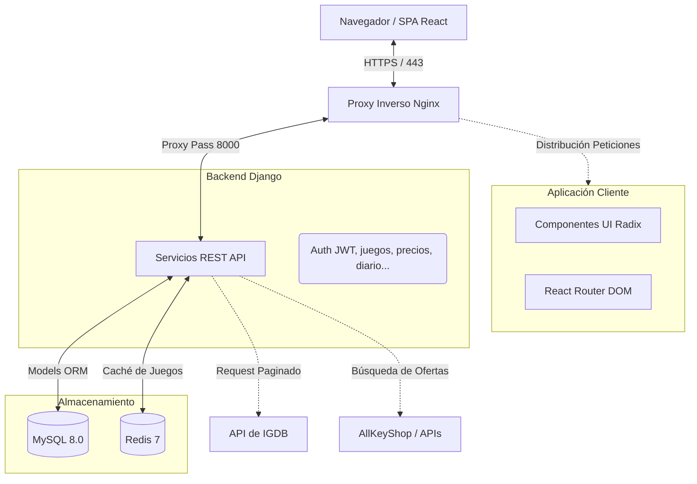

<div align="center">

#  GameS (Gestor de Videojuegos)

**Plataforma web integral para descubrir, organizar y gestionar videojuegos, con búsqueda avanzada, historial de precios y recomendaciones personalizadas.**


[](https://react.dev/)
[](https://www.djangoproject.com/)
[](https://www.mysql.com/)
[](https://redis.io/)
[](https://www.docker.com/)

[](LICENSE)
[](#)

<br/>

[ Inicio Rápido](#inicio-rápido) · [ Documentación](#uso) · [ Problemas](../../issues)

</div>

---

##  Tabla de Contenidos
- [Sobre el Proyecto](#sobre-el-proyecto)
- [Stack Tecnológico](#stack-tecnológico)
- [Arquitectura](#arquitectura)
- [Inicio Rápido](#inicio-rápido)
  - [Requisitos Previos](#requisitos-previos)
  - [Instalación](#instalación)
  - [Variables de Entorno](#variables-de-entorno)
- [Uso](#uso)
- [Scripts Disponibles](#scripts-disponibles)
- [Estructura del Proyecto](#estructura-del-proyecto)
- [Pruebas](#pruebas)
- [Despliegue](#despliegue)
- [Licencia y Derechos](#licencia-y-derechos)

---

##  Sobre el Proyecto

> **GameS** es un gestor de videojuegos conceptualizado y desarrollado para ofrecer una experiencia completa a los apasionados de los juegos. Permite a los usuarios consultar información meticulosamente extraída de IGDB, planificar sus sesiones, administrar meticulosamente bibliotecas personales, hacer un seguimiento del tiempo y descubrir las mejores ofertas y precios históricos del mercado de claves. Todo bajo una interfaz estilizada y responsiva con un backend dinámico preparado para optimización por tráfico.

###  Características Principales

-  **Catálogo Completo con IGDB** — Integración automática con la API de IGDB para disponer de la base de una de las mayores plataformas de internet. El proyecto usa Redis para almacenar la data localmente y agilizar brutalmente las peticiones de búsquedas.
-  **Buscador Inteligente de Ofertas** — Rastreador de precios con base en AllKeyShop con algoritmo de mapeo automático de títulos (haciendo conversiones en títulos con numeración romana y procesando resultados para mostrarlos perfectamente agrupados por consola y rebajados).
-  **Gestión de Colección y Tiempo diario** — Registra y modera tus sesiones. Haz un recuento de tu tiempo jugado o añade notas en formato de diario, con estadísticas precisas.
-  **Recomendaciones Personalizadas** — Motor de recomendaciones propio y automático basado en los géneros de los videojuegos alojados en la biblioteca del usuario.
-  **Sistema Temático Adaptativo** — Interfaz altamente cuidada que guarda automáticamente tu preferencia Visual con tema Claro y Oscuro guardado en cache de forma persistente.

---

##  Stack Tecnológico

| Categoría | Tecnología |
|----------|-----------|
| **Frontend** | [](https://react.dev/) [](https://vitejs.dev/) [](https://tailwindcss.com/) |
| **Backend** | [](https://www.djangoproject.com/) [](https://www.python.org/) |
| **Base de Datos** | [](https://www.mysql.com/) [](https://redis.io/) |
| **DevOps / Servidor** | [](https://www.docker.com/) [](https://nginx.org/) [](https://gunicorn.org/) |
| **Auth** | JWT (SimpleJWT) |

---

##  Arquitectura



---

##  Inicio Rápido

### Requisitos Previos

Asegúrate de contar con lo siguiente instalado en tu host o máquina de despliegue:

- **Docker** `>= 20.x`
- **Docker Compose** `>= 2.x`
- En caso de ejecutar en formato de pre-desarrollo local y nativo, precisarás **Node.js** v20+, **Python** 3.10+, **MySQL Server** 8+, **Redis** 7+

### Instalación

```bash
# 1. Clonar el repositorio
git clone https://github.com/zenithseed/GameS.git
cd GameS

# 2. Configurar las variables de entorno
cp .env_example .env
# IMPORTANTE: Reemplazar las credenciales, secrets y hosts vacíos del .env de manera acorde.

# 3. Construir y Levantar servicios (Modo Producción con Compose)
docker-compose up -d --build

# (Opcional - Levantando únicamente Frontend aisladamente)
cd frontend
npm install
npm run dev
```

### Variables de Entorno

Variables a completar alojadas en `.env`:

| Variable | Descripción | Requerimiento | Default Referencia |
|----------|-------------|:----------:|---------|
| `DEBUG` | Mostrar trazados de errores de Django | ✅ Sí | `1` |
| `DJANGO_SECRET_KEY` | Credencial secreta de seguridad del sistema | ✅ Sí | - |
| `DJANGO_ALLOWED_HOSTS` | Array de Hostnames admitidos | ✅ Sí | - |
| `CSRF_TRUSTED_ORIGINS` | Orígenes cors autorizados para envíos POST | ✅ Sí | - |
| `MYSQL_DATABASE` | Nombre final de la DB local | ✅ Sí | - |
| `MYSQL_USER` | Nombre de usuario propietario | ✅ Sí | - |
| `MYSQL_PASSWORD` | Pass del user propietario | ✅ Sí | - |
| `MYSQL_ROOT_PASSWORD` | Pass maestro MySQL | ✅ Sí | - |
| `DB_HOST` | Host DB desde Backend (en red Docker) | ✅ Sí | `db` |
| `DB_PORT` | Puerto relacional expuesto | ✅ Sí | `3306` |
| `REDIS_HOST` | Host para Caché (en red Docker) | ✅ Sí | `redis` |
| `REDIS_PORT` | Puerto de escucha Redis | ✅ Sí | `6379` |
| `VITE_API_BASE_URL` | Base URL a la ruta de Nginx en Frontend | ✅ Sí | `/api` |
| `IGDB_CLIENT_ID` | Clave API Twitch Developers / IGDB | ⚠️ Si se actualiza | *(Predefinido)* |
| `IGDB_CLIENT_SECRET`| Token rotador de IGDB | ⚠️ Si se actualiza | *(Predefinido)* |

---

##  Uso

### Estructura base
La aplicación centraliza la experiencia en el frontend expuesto nativamente en los puertos de Nginx (habitualmente 443 vía TLS si Cloudflare está enganchado o por el 80 directo). 

Redis inicializa inmediatamente una captura del repositorio de IGDB la primera vez que inicia o durante horas de baja actividad programada para almacenar localmente lo mas destacable de la red y optimizar las búsquedas. 

### Gestión Automática
Nginx se gestiona de forma global en `nginx-central` fuera del contenedor (para configuraciones custom multiproyecto del host), sin embargo, este proyecto cuenta con un volumen específico `./nginx/conf.d` incrustado como solo-lectura para configurar sus virtualhosts de forma modularizada y escalable.

---

##  Scripts Disponibles

Orientados principalmente al Frontend y la integración continua:

| Comando | Descripción |
|---------|-------------|
| `npm run dev` | Levanta servidor de React vía Vite con actualizacion de modulos "en-caliente". |
| `npm run build` | Genera estáticos y assets minimizados listos para su inmersión en Producción en el proxy Nginx. |
| `npm run lint` | Validador Linter de estructura e importaciones de ES6. |
| `npm run preview` | Pre-visualización compilada post-build. |

Comandos frecuentes Backend (`manage.py`):
`migrate`, `collectstatic`, y `runserver` integrados por consola. En el entorno real de Docker Compose el contenedor lanza predeterminadamente `gunicorn gestor_videojuegos.wsgi:application --bind 0.0.0.0:8000` con `migrate` embebido al iniciar.

---

##  Estructura del Proyecto

```text
GameS/
├── backend/                # Aplicación en Django Rest Framework
│   ├── actividad/          # Lógica para registro de actividades y estadísticas
│   ├── apiPrecios/         # Core Scraper y parser de APIs comerciales (Aks)
│   ├── comentarios/        # Gestión del sistema social de reseñas
│   ├── gestor_videojuegos/ # Entrada principal, urls core y Settings.
│   ├── juegos/             # Gestión de la caché Redis e integracion con IGDB.
│   ├── notificaciones/     # Envío de alertas on-the-fly al front.
│   ├── usuarios/           # Custom User Auth, perfiles en JWT y recomendaciones.
│   ├── manage.py           # CLI de desarrollo nativo Django
│   └── requirements.txt    # Manifiesto de PIP Python
├── frontend/               # SPA construida con React + Vite
│   ├── public/             # Estáticos base, íconos y Favicon de identidad
│   ├── src/                # Vistas, context, utilidades, librerías y componentes.
│   ├── package.json        # Deps de NPM (+ Tailwind, Radix)
│   └── vite.config.js      # Rulesets de bundler
├── nginx/                  # Reglas del proxy Nginx para el módulo GameS
├── cloudflare/             # Certificados TLS preconfigurados mTLS/Origin
├── docker-compose.yml      # Declarativa Infra con BD, Backend, Frontend y Caché
└── README.md               # Esta extensa hoja de Vida del proyecto
```

---

##  Pruebas

Lanza la consola interactiva test del framework de Python directamente con:
```bash
cd backend
python manage.py test
```

Verificación del Frontend (Análisis estático modularizado):
```bash
cd frontend
npm run lint
```

---

##  Despliegue

La plataforma usa `docker-compose` atada fuertemente a mecanismos del orquestador exterior:
- Consta de etiquetas de **Sablier** (`sablier.enable=true` / `sablier.strategy=dynamic`) en el servicio del backend, dispuestas para paralogizar auto-suspensión de los bins Docker bajo falta de tráfico web, optimizando al máximo un despliegue VPS o Host de baja capacidad. 
- Contempla el enrutamiento directo de sus volúmenes hacia la recolección estática (`media_data`), y la incrustación de certificados firmados por Cloudflare.

```bash
docker-compose --env-file .env up --build -d
```

---

##  Licencia y Derechos

© Copyright - Todos los derechos del código fuente y logotipos de GameS pertenecen y están adjudicados exclusivamente a su autor principal.

**Este es un proyecto privativo y la copia, reproducción, venta o uso no autorizado en terceros servicios externos se encuentra prohibido según la jurisdicción actual.** No se aceptan Pull Requests ni participaciones externas.

---

<div align="center">

**Diseñado y Construido con  por Sebas (ZENITHSEED)**

</div>
